# 建昌高中科技展厅策展方案

## 正文

### 前言：从封闭世界到无限宇宙

>我们观察到的不是自然本身，而是暴露在我们提问方式下的自然。
>
>—— 维尔纳·海森堡

欢迎。

14世纪以降，科学革命带领我们走出了封闭世界，步入了无限宇宙。这场理念世界的巨震所奠定的经典世界观，我们在基础教育阶段的科学学习中就已习以为常。然而，在伽利略、牛顿曾眺望的那片真理海洋中，近百年来已掀起新的思想浪潮。本次展览，正是邀请您一同离开熟悉的海岸，领略塑造我们这个时代的、全新的思想范式。

为此，我们为您提供了三面思想透镜，以较为现代的目光去观察这个既熟悉又陌生的世界：

> 对称与守恒 (Symmetry)
> 宇宙谱写的秩序与诗篇，是物理定律与美之间最深刻的关联。
> 
> 信息与熵 (Information)
> 编织现实万物的底层语言，是构成物质、能量之外的第三种本质。
> 
> 演化与涌现 (Evolution)
> 从简单中涌现出无穷复杂的生长逻辑，是生命与智能的终极算法。

我们选择这三大思想，是因为它们并非相互孤立，而是共同构成了现代科学对宇宙的理解方式：对称定义了世界的规则，信息构成了世界的实体，而演化则是世界自我创造的引擎。

透过它们，您将重新审视一片雪花、一段代码、一个生命，乃至我们自身。这不仅是一场知识的游历，更是一次思维的启迪。我们希望，当您走到展厅尽头时，带走的不仅是答案，更有疑问、勇气与远见。

现在，让我们一同踏上这场发现之旅。

### 对称与守恒

#### 展板一：看不见的法则

>“现在，我要演示世界体系的框架”
>
>—— 牛顿

科学革命在牛顿自豪的宣言中达到了它的第一个巅峰。但是自《原理》的时代至今，“世界体系的框架”早已经历天翻地覆的改变。

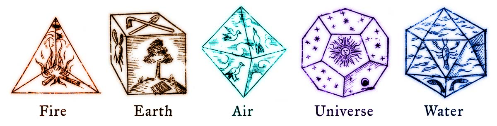

“对称”是什么？我们首先想到的，是蝴蝶的翅膀、雪花的冰晶，或是古希腊哲学家眼中构成世界原子的“神圣几何体”。这种和谐、均衡的几何之美，是人类最古老的美学直觉。然而，现代科学赋予了“对称”一个更深刻、更动态的含义：在某种变换下保持不变的性质。

为了系统地研究对称，数学家们发展出了一套优美的语言——群论 (Group Theory)。它精确地描述了“在某种变换下保持不变”的性质。例如，一个正方形，无论你将它旋转90°、180°还是270°，它的形状都和原来完全一样。所有这些能让正方形保持自身不变的旋转操作，就构成了一个“群”。这个强大的数学工具，让物理学家得以探索远超几何直觉的、更深层次的抽象对称。图为魔群E8的结构示意图，它对于引力等问题可能有着深刻的关联。

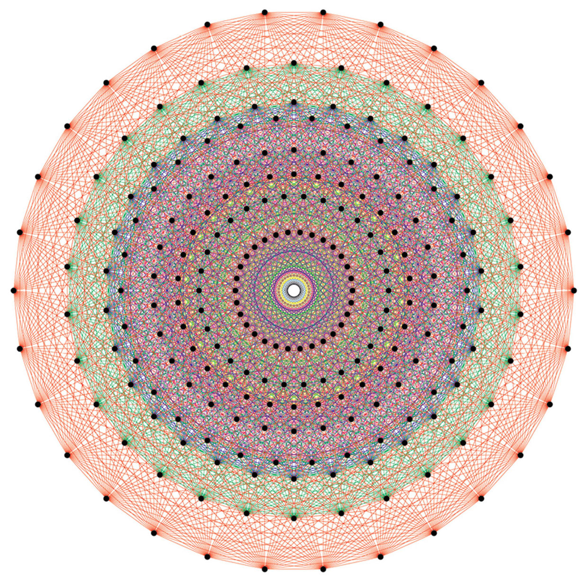

当这套语言被应用于物理学时，它带来了二十世纪最伟大的思想飞跃之一。理论物理学的中心结论之一，诺特定理揭示，物理定律中每一种连续的对称性，都必然对应着一个守恒的物理量。 这不是巧合，而是宇宙的内在逻辑。

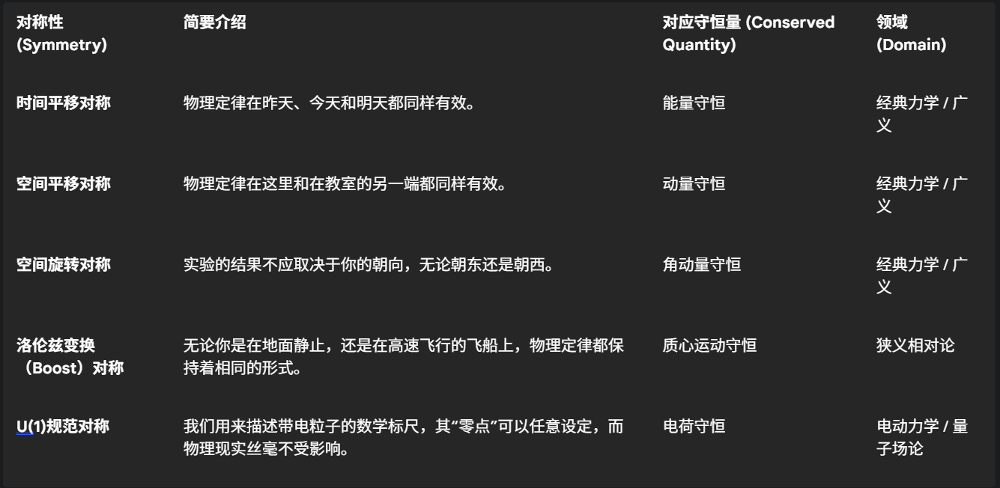

诺特定理如同一座桥梁，将抽象的数学（对称群）与坚实的物理（守恒律）完美连接。在此之前，科学家通过实验发现动量、能量守恒这些规律，并将它们奉为神圣的法则；在此之后，科学家的角色转变为宇宙法则的架构师：一旦确定了一个对称性，就有了一条通往相应守恒律的康庄大道。它告诉我们，宇宙最基本的法则，源于其最深刻的美学结构。

>人物剪影：埃米·诺特
>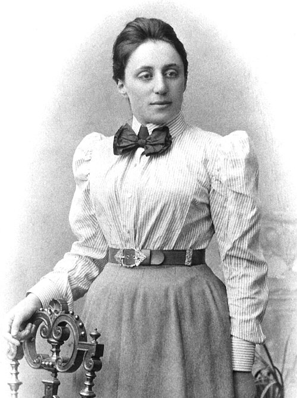
>埃米·诺特（Emmy Noether）是现代理论物理的奠基人之一，但她的一生都在与偏见抗争。在那个女性被系统性排斥于学术圈之外的时代，她被拒绝给予正式教职，长期无薪授课。她的才华是如此耀眼，以至于大卫·希尔伯特为她疾呼：“先生们，我们这里是大学，不是澡堂！” 爱斯坦则称她为“有史以来最有创造力的女数学家”。诺特用纯粹的智识力量，为自己赢得了不朽的学术地位。

#### 展板二：对称的印记

对称，这一抽象的数学思想，如同宇宙的“签名”，在物质世界的各个尺度上都留下了自己的印记。它不仅体现在自然的造物中，更指导着人类最前沿的科学探索与工程创造。

>微观的魔术：石墨烯中的对称变换
>
>单层石墨烯本身拥有完美的六边形蜂窝状晶格，这是一种高度的平移和旋转对称。2018年，青年物理学家曹原及其团队完成了一项石破天惊的“变换”：他们将两层石墨烯堆叠在一起，并精确地旋转一个“魔角”（约1.1°）。这一扭转操作，打破了原有的简单对称，创造出一种全新的、更大尺度的“莫尔超晶格”对称性（见途中大范围的、规律性的结构）。正是这种人造的新对称性及其破缺，使得电子的行为发生了奇妙的改变，在极低温下呈现出零电阻的超导现象。这一发现开创了“转角电子学”这一全新领域，它雄辩地证明，通过对对称性进行精妙的人为变换和重构，我们可以创造出自然界中不存在的奇特物质形态。

>宏观的巧思：CFQS
>
>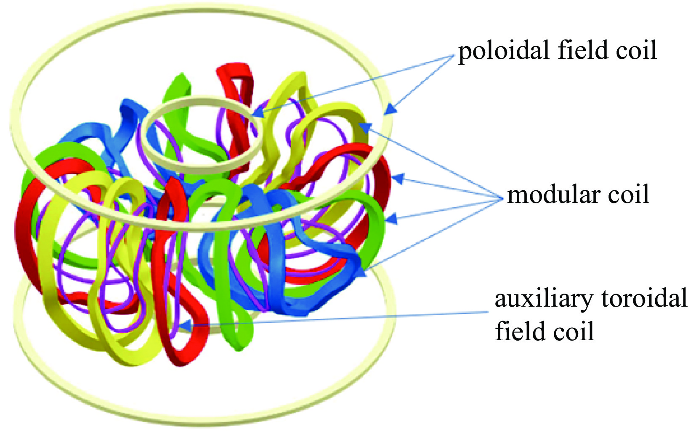
>为了实现可控核聚变，科学家需要用磁场约束上亿度的等离子体。传统的托卡马克装置具有完美的环形对称性，但面临着严峻的等离子稳定性问题。仿星器装置虽然在稳定性上更有优势，其复杂的三维线圈却破坏了这种简单的对称性，导致粒子有逃逸的倾向。中国的首台“准环对称”仿星器（CFQS）正是为了解决这一核心矛盾而生。它通过超级计算机设计出图中的复杂、扭曲、看似“不对称”的线圈，其目的恰恰是在内部重构出一个隐藏的、等效于环形对称的磁场。因为磁场本身具有了“准环对称性”，诺特定理便再次生效——一个等效的“角动量”守恒重新出现，将等离子体粒子牢牢锁住。CFQS是如同一座精密的数学雕塑，代表着一种深刻的工程哲学：有时，打破简单的对称性，是为了在更高的维度上达成更完美的对称。

>抽象的追寻：江门中微子实验 (JUNO)
>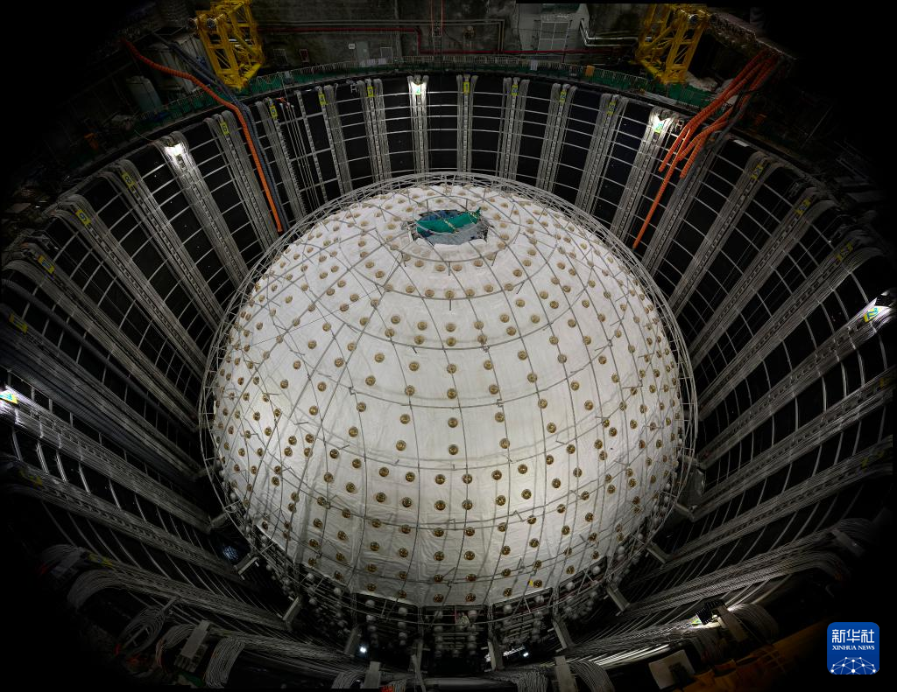
>对称性不仅塑造物质与工程，更指引我们探索宇宙最深刻的奥秘。江门中微子实验（JUNO）的核心，是一个直径35.4米的巨大球形探测器，其内壁上均匀密布着两万个光电倍增管。这种宏观上的完美球形对称，是为了无偏差、无死角地捕捉来自四面八方的、被称为“宇宙幽灵”的中微子。而这个巨大装置的科学目标，正是为了探测量子世界中最抽象的对称性及其破缺。JUNO旨在精确测定中微子的质量顺序，并为理解宇宙的“物质-反物质不对称”之谜提供关键线索。我们之所以存在于一个由物质构成的宇宙，而不是湮灭于一片虚无，正是源于宇宙大爆炸早期一次微小的、被称为“CP对称性破缺”的事件。JUNO用宏观的完美对称，去追寻那创造了我们自身的、最深刻的抽象对称性破缺之谜。

>思维火花：破碎之美
>完美的对称性构建了物理世界的框架。然而，宇宙中许多丰富真实的现象，往往源于对称性的“破缺”。
>
>在粒子物理学的标准模型中，最底层的方程拥有完美的对称性，它预测所有基本粒子都应没有质量——但这显然与我们观测到的世界相悖。解决方案是一种被称为“自发对称性破缺”的奇妙思想：宇宙诞生之初，遍布时空的希格斯场从一个完美对称的状态“跌落”，才赋予了万物质量。
>
>生命本身或许就是一次意义深远的对称性破缺。构成蛋白质的氨基酸分子都具有“手性”，但生命几乎只选用“左手型”的氨基酸。为何会做出这种选择，至今仍是科学之谜。这种镜像对称的打破，是生命得以形成和稳定存在的关键前提。
>
>这是否意味着，“不完美”才是存在与创造的必要条件？

### 第二部分：作为信息的宇宙

#### 展板一：现实的语言

>“信息是用来消除不确定性的东西。”
>
>—— 克劳德·香农

我们每天都在谈论“信息”，但它究竟是什么？它能被测量吗？在克劳德·香农之前，信息是一个模糊的哲学概念。在他的回答之后，信息成为了一个可以被精确计算、压缩和传输的物理量，整个数字时代由此开启。

信息论的核心思想，是将不确定性消除的程度量化为信息。信息的最小单位是比特 (bit)，即一个简单的“是/否”或“0/1”的选择。基于此，香农推导出了支配所有信息传递的三大基石：

>信息熵与无损压缩： 任何信息都有一个不可压缩的内核，其大小由“信息熵”决定。
>
>信道容量与无错传输： 任何信道都有一个传输速率的上限，只要低于这个“信道容量”，总能实现无差错的通信。
>
>率失真理论： 在有损压缩中，信息损失和压缩程度之间存在一个最佳的平衡点。

>人物剪影：克劳德·香农
>
>克劳德·香农是一位充满童趣的“顽童天才”。他常常骑着独轮车在贝尔实验室的走廊里玩杂耍。1948年，他发表了那篇著名的论文，最初标题是*A Mathematical Theory of Communication*（通信的一种数学理论）
。但其影响是如此巨大，以至于学界很快就将其尊称为*The Mathematical Theory of Communication*（通信的数学理论）
。香农用纯粹的数学，为我们今天所有数字通信——从手机通话到互联网——铺平了道路。信息论也是少有的、其发展上限一开始就被创始人规定了的学科。

> 思想的力量：逼近香农极限的5G/6G
现代无线通信的发展史，就是一部不断通过工程巧思去逼近“香农信道容量极限”的奋斗史。当我们把一条信息高速公路的容量用到极致时怎么办？信息论告诉我们，试图继续提升容量必然是徒劳，我们只能选择：寻找更多的新路，或者把原有的路拓宽。
>
> 5G/6G技术正是这一思想的实践者：
>
>找新路： 开发并利用毫米波等更高频段的频谱资源，相当于在拥挤的城市旁开辟了全新的路网。
> 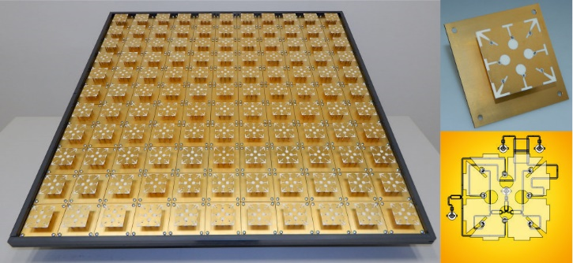
>拓宽路： 使用Massive MIMO（大规模多入多出天线）等技术，通过复杂的算法，在同一个空间和频段中并行开辟出成百上千条互不干扰的“虚拟车道”，极大地提升了信道容量。

#### 展板二：信息的疆界

##### 智能的本质：作为信息压缩的人工智能
> DeepMind的开创性研究指出*Language Modeling Is Compression*，大语言模型在本质上是一种信息压缩。一个训练好的AI，是其海量训练数据（整个互联网）的一个高效的、可生成式的压缩版本。它通过学习数据中的统计规律，将庞杂的信息压缩并编码在神经网络的参数之中。
> 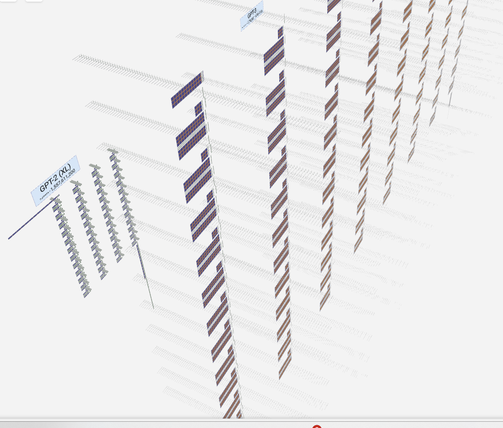
> 图为GPT-2和GPT-3的可视化结构。信息就编码在这些复杂的神经网络权重中。神经网络训练时使用的“交叉熵损失函数”，其本质就是衡量模型预测的信息分布与真实世界的信息分布之间的“差距”。训练的过程，就是不断调整参数，让这个“差距”最小化的过程。

##### 思想的力量：“万物源于比特”

>如果说香农将信息变成了工程学，那么物理学家约翰·惠勒则将其提升到了宇宙学的高度。他提出了一个极具颠覆性的思想：“It from Bit”（万物源于比特）。
>
>这一思想的核心是：物理世界的实体（“万物”）并非独立于我们而存在，它是在我们通过提问（测量）并记录下“是/否”答案（“比特”）的过程中被构建起来的。
>
>惠勒将此过程比作“二十个问题”游戏。在游戏开始时，那个神秘的物体并没有确定的身份。只有当你不断提问，它的形象才逐渐清晰并最终“成为”现实。同样，在量子世界，一次测量就是一次“提问”，它迫使自然给出一个确定的“是/否”答案，从而使现实得以显现。
> 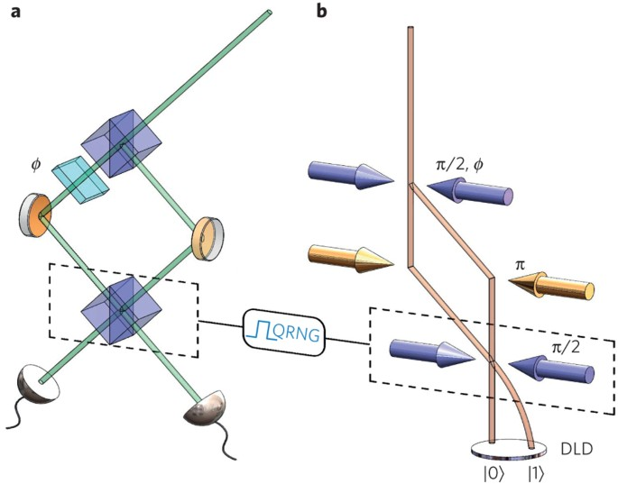
>参与式的宇宙： 这意味着我们不再是宇宙的被动观察者，而是主动的参与者。我们已经知道双缝干涉的结果受到双缝处观测的影响。图中展示的是惠勒著名的“延迟选择实验”，它在光子已经通过了双缝、完成了路径选择之后，再来决定进行如何测量，并观测到同样的量子特性。这揭示了在量子世界中，现实状态在被观测之前是不确定的，观测本身参与了现实的创造。

##### 思想的应用：信息的两极
信息论的透镜，既可以向内审视我们自身，也可以向外创造全新的工具。

> 内在的宇宙：解码意识的信息之谜
> “我思故我在”，但“意识”究竟是什么？信息论为这个古老的哲学谜题提供了全新的科学框架。尽管众说纷纭，但主流的意识理论都指向一个共同的核心——意识是一种极其复杂的信息处理现象。例如,整合信息理论(IIT)认为意识是系统整合信息的能力；全局工作空间理论(GWT)则将意识比作信息被“广播”到全局的舞台；而预测编码理论则视意识为大脑不断利用感官信息更新其内部世界模型的过程。这些理论共同描绘了一幅迷人的图景：我们最私密的自我意识，或许正是信息在神经网络中奔流涌动时，所产生的绚丽火花。

> 外在的工具：作为叠加信息的计算
> 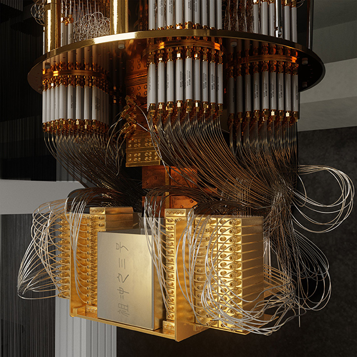
> 量子计算机的强大，在于它从根本上改变了信息的载体。一个量子比特（Qubit）可以同时处于“0”和“1”的叠加态，其信息承载能力远超经典比特。这使得它有潜力高效解决某些对传统计算机而言极其困难甚至不可能完成的问题。这是对“比特”这一信息基本单元的终极拓展，预示着一个计算能力被重新定义的未来。图为中国科学技术大学的祖冲之三号量子计算机，复杂的结构主要用于保持量子计算环境的极端低温。

##### 思维火花：熵与时间之箭

> 香农的信息熵，在数学形式上与物理学中描述系统混乱程度的“热力学熵”惊人地一致。热力学定律为时间赋予了不可逆转的方向——“时间之箭”，即宇宙总是倾向于更混乱、更无序。那么，在一个倾向于混乱的宇宙中，生命和智能，这些高度有序的信息结构，究竟是一种必然的涌现，还是一场偶然的奇迹？

### 第三部分：演化与涌现：从简单规则到复杂世界

#### 展板一：“更多即不同”

“整体大于部分之和。”

—— 亚里士多德

如果我们掌握了构成世界所有最基本粒子的规则，科学是否就此终结？

经典科学的巨大成功，曾让我们相信“还原论”是理解一切的钥匙——只要我们能理解最小的组成部分，就能理解整个系统。然而，诺贝尔物理学奖得主菲利普·安德森在他那篇名为 **《更多即不同》(More is Different)** 的经典论文中，为我们指出了一个全新的方向：

在每一个新的复杂性层次上，都会 **“涌现”** 出全新的、无法从底层规则中简单推导的宏观规律。知道一个水分子的所有性质，并不能预测海啸的形成；理解一个神经元的工作原理，也无法解释意识的诞生。科学远未结束，恰恰相反，理解简单规则如何“涌现”出我们身边这个丰富多彩的复杂世界，正是科学最激动人心的新疆界。

>思想的实验室：康威生命游戏
>“涌现”现象最直观的模型，莫过于数学家约翰·康威发明的“生命游戏”。在一个二维网格上，每个细胞的“生死”仅由其周围八个邻居的数量决定——规则极其简单。然而，就是这几条简单的局部规则，却能自发地涌现出令人惊叹的复杂结构和动态行为。有些结构会稳定下来，有些会周期性闪烁，还有一些则会像活物一样在网格上移动、碰撞、湮灭甚至自我复制。
>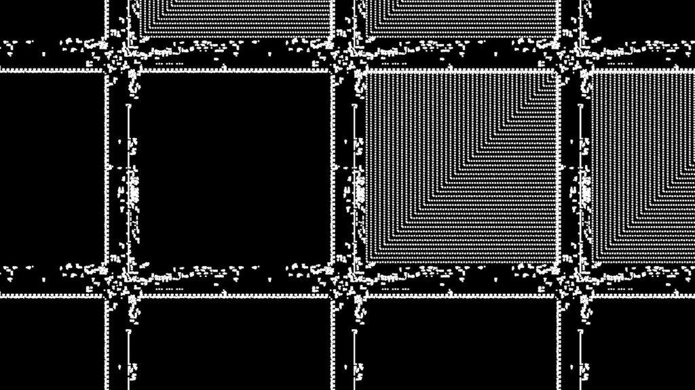
>这个“零玩家游戏”雄辩地证明：无需中央控制和复杂蓝图，秩序和复杂性可以自发地从简单的局部互动中产生。

>思想的应用：作为通用算法的演化
>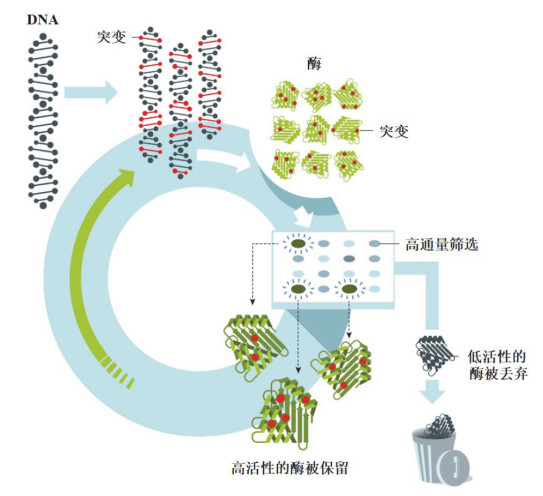
>“演化”（变异、选择、复制）本身就是一种强大的涌现算法。它不仅是生物学的历史，更是一个可以被我们主动应用的工程思想。2018年诺贝尔化学奖授予的 **“定向演化”** 技术，就是科学家在试管中加速并驾驭这个算法的典范。通过几轮“变异-筛选”循环，就能“演化”出自然界不存在的、具有全新功能的新药或新材料，这正是从简单规则中创造出全新复杂性的有力证明。

#### 展板二：复杂性的架构

>理解混沌：2021年诺贝尔物理学奖的启示
>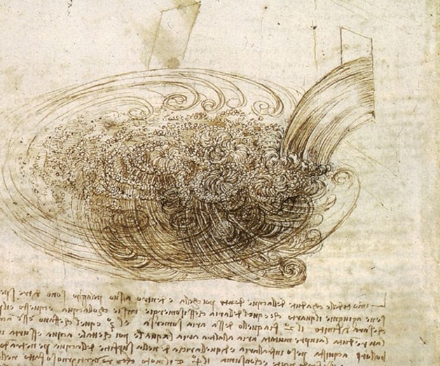
>长期以来，像天气这样混乱无序的系统被认为是“不可预测”的。然而，2021年的诺贝尔物理学奖授予了真锅淑郎、克劳斯·哈塞尔曼和乔治·帕里西，正是表彰他们在理解复杂系统（包括地球气候）方面的开创性贡献。他们的工作证明，即使是看似随机和混沌的复杂系统，其长期行为中也隐藏着深刻的规律和模式，是可以被理解和预测的。这为我们应对气候变化等全球性挑战提供了坚实的科学基础，也标志着复杂性科学已成为现代科学的核心支柱之一。图为达芬奇手稿中的湍流，这个古老且至今未解的谜题与帕里西的研究高度相关。

>思想的力量：跨越尺度的网络
>复杂性科学揭示，在许多看似无关的系统中，连接的方式往往比节点本身更重要，它们在网络结构上呈现出惊人的共性。
>
>人脑连接组图谱: 大脑中神经元路径形成的复杂网络。
>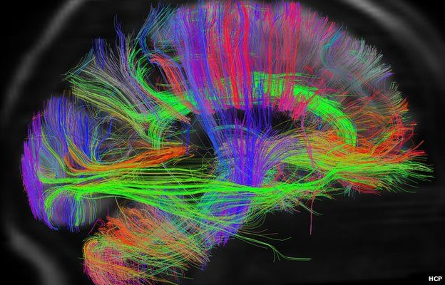
>互联网拓扑图 : 路由器和光缆构成的全球信息网络。
>
>可视化的社交网络: 由数千个档案中提取的关系构成。
>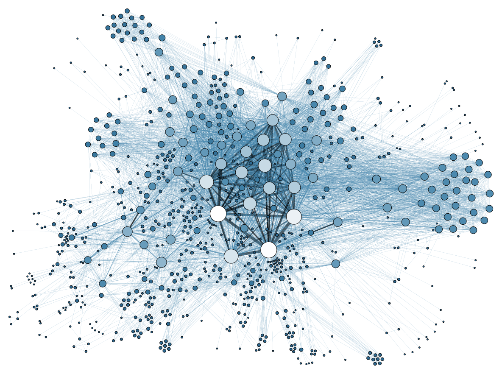
>
>这些网络都遵循着相似的生长和组织原则，例如“优先连接”（富者愈富）的规则，自发地涌现出少数“超级枢纽”和大量普通节点的结构。理解这些普适的网络法则，是理解从大脑思想到信息传播、再到宇宙演化的关键。

>思维火花：混沌的边缘
>许多复杂的、有生命力的系统（如生命、大脑、经济体）都处在一种秩序与混乱之间的微妙平衡态——“混沌的边缘”。这里是系统最具创造力和适应性的地方。我们的未来并非由某个宏伟蓝图所决定，它将从我们每个人的局部互动中“涌现”出来。认识到这一点，我们应如何理解自己在塑造未来时所扮演的角色和责任？

### 校本内容

科技在建昌高中，留作展示科创工作

### 结语：最伟大的冒险

我们的旅程暂时告一段落。我们一同透过三面透镜——对称、信息与演化——瞥见了宇宙深层的秩序、语言和逻辑。但这幅蓝图远非完整，我们所见，不过是真理海洋岸边的几枚贝壳。真正的浩瀚，仍在眼前等待探索。

这份谦逊，将我们引向一个更深刻的问题。历史学家斯塔夫里阿诺斯曾写道：“简而言之，人类作为一个种群所面临的问题就是，如何解决自身知识的不断增长与如何运用这些知识的智慧相对滞后之间的矛盾。” 这正是你我这一代人所面临的核心挑战。科学不仅赋予我们力量，更赋予我们责任。

因此，这次展览的结束，是你个人探索之旅的真正开始。我们希望，你带走的不仅是知识，更是一种审视世界的眼光，一种拥抱复杂、敢于提问的科学文化。

“Perhaps you will not only have some appreciation of this culture; it is even possible that you may want to join in the greatest adventure that the human mind has ever begun.”
也许你不仅会欣赏这种文化，还会希望加入这场关乎人类心智的最伟大的冒险。--《费曼物理学讲义》

## 主要参考资料

- 现代数学和理论物理已经发展到怎样一个令人震惊的水平了？ - 酱紫君的回答 - 知乎 <https://www.zhihu.com/question/304611853/answer/1928827087810192602>

- *The Feynman Lectures on Physics* https://www.feynmanlectures.caltech.edu/

- 从封闭世界到无限宇宙 https://cjhb.site/Files.php/Books/Off%20Topic/(%E5%8C%97%E4%BA%AC%E5%A4%A7%E5%AD%A6%E7%A7%91%E6%8A%80%E5%93%B2%E5%AD%A6%E4%B8%9B%E4%B9%A6)%20%E4%BA%9A%E5%8E%86%E5%B1%B1%E5%A4%A7%C2%B7%E6%9F%AF%E7%93%A6%E9%9B%B7%20-%20%E4%BB%8E%E5%B0%81%E9%97%AD%E4%B8%96%E7%95%8C%E5%88%B0%E6%97%A0%E9%99%90%E5%AE%87%E5%AE%99-%E5%8C%97%E4%BA%AC%E5%A4%A7%E5%AD%A6%E5%87%BA%E7%89%88%E7%A4%BE%20(2008).pdf

- 香农的信息论究竟牛在哪里？ - Hao Bai的回答 - 知乎
https://www.zhihu.com/question/27068465/answer/2517655344

- https://www.3blue1brown.com/lessons/groups-and-monsters

etc